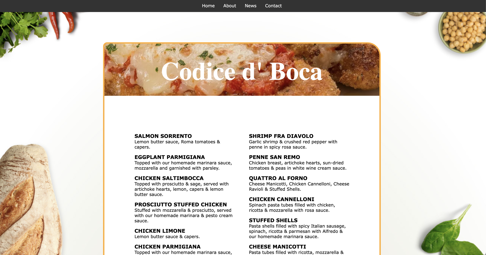
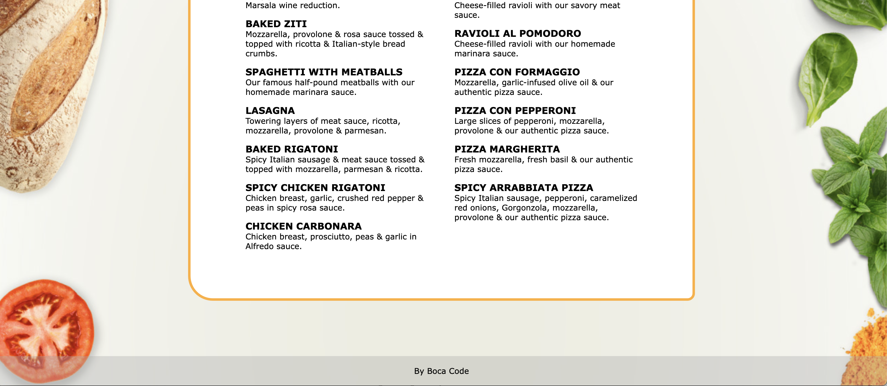

# Codice D Boca menu 

Created with plain HTML / CSS / Javascript pulling menu items from API

1. Clone Repo
2. Get `#menu` from index
3. Using Fetch populate all menu items from API https://codice-boca.web.app/menu

